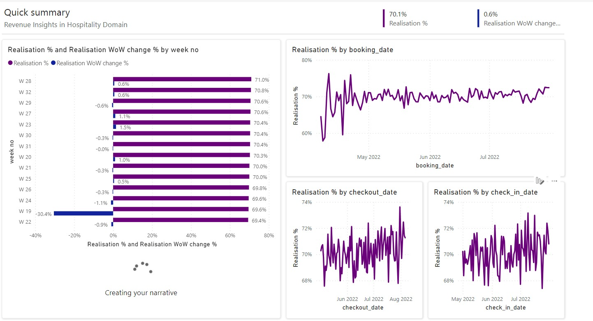
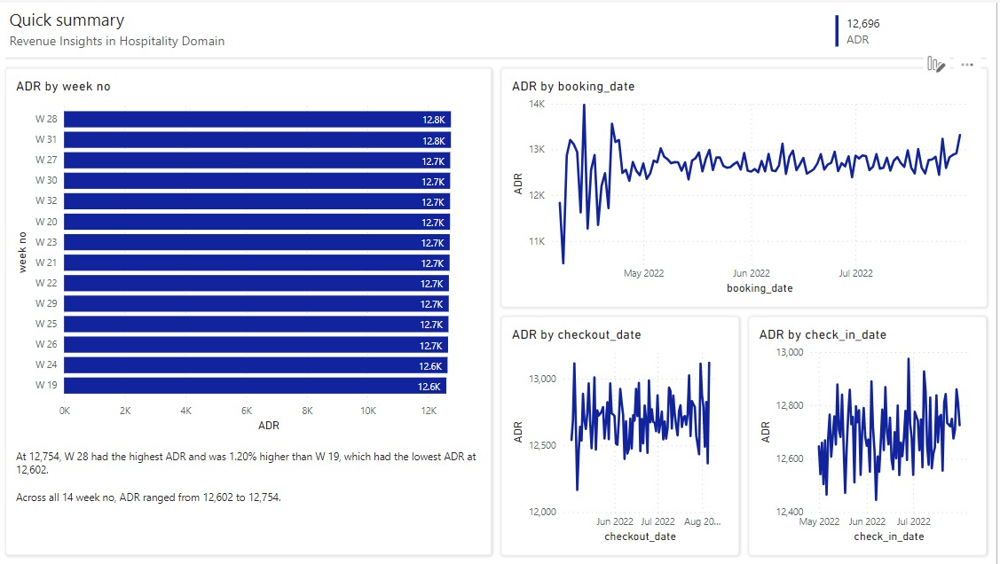
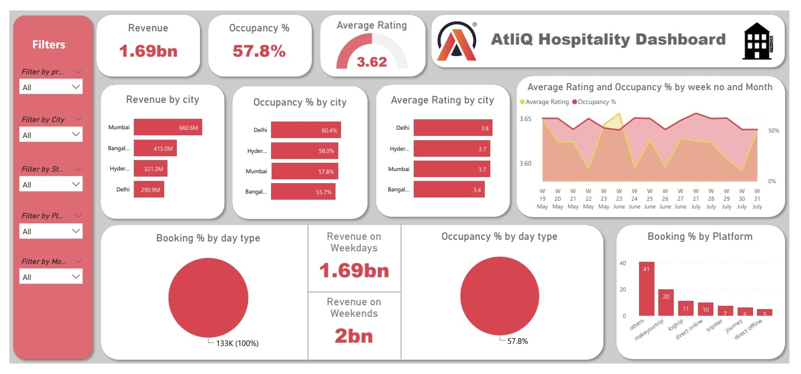

# Revenue Insight of Hospitality Domain
<b>Domain :<b/>Hostpitality<br>
<b>Function :<b/>Revenue


## Background

AtliQ Grands owns multiple five-star hotels across India. They have been in the hospitality industry for the past 20 years. Due to strategic moves from other competitors and ineffective decision-making in management, AtliQ Grands are losing its market share and revenue in the luxury/business hotels category. As a strategic move, the managing director of AtliQ Grands wanted to incorporate “Business and Data Intelligence” to regain their market share and revenue.

As a data analyst I have created new interactive dashboard by using provided sample data and a mock-up dashboard to work on the following task-

* To create the metrics according to the metric list.
* To create a dashboard according to the mock-up provided by stakeholders.
* To create relevant insights that are not provided in the metric list/mock-up dashboard.

## Files

* Booking date - [dim_date.csv](Hostpitality_Analysis_Dashboard/dim_date.csv)
* Hotels [dim.csv](Hostpitality_Analysis_Dashboard/dim_hotels.csv) 
* Hotal Room Type [dim_rooms](Hostpitality_Analysis_Dashboard/dim_date.csv)
* Matrics List - [Key Matrics Formula List.xlsx](Hostpitality_Analysis_Dashboard/KeyMatricsFormula.xlsx)
* Revenue Insight Dashbord [Dashboard Starter Jupyter Notebook](Hostpitality_Analysis_Dashboard/InsightReport.pdf)

### Rental Analysis

The first step to building the dashboard is to work out all erros, null values and all the calculations and visualizations.

WoW - Week-on-Week (WoW) is a type of business metric that measures changes in a specific variable over a period of one week compared to the previous week. It is a common way of tracking business performance over time and is particularly useful for analyzing trends and identifying areas where improvements can be made.

### Visualisation of key matrices and DAX Calculation- 

   
```
   Revenue = SUM(fact_bookings[revenue_realized])
```
```
    RevPAR = DIVIDE([Revenue],[Total Capacity])
```
```
   DSRN = DIVIDE([Total Capacity], [No of days]))
```
```
   ADR = DIVIDE( [Revenue], [Total Bookings],0)
```
```
   Realisation % = 1- ([Cancellation %]+[No Show rate %])
```
```
   Occupancy % = DIVIDE([Total Succesful Bookings],[Total Capacity],0)
```

# Trends of Key Matrics Insights

## Revenue Trends - 

1. Recent Trend -
      * Realisation % started trending up on Monday,Auguest 1,2022 rising by 0.08%(0.1%) in 4 days.


## Realisation % Trends -

1. Recent Trend -
      * Realisation % started trending up on Monday,Auguest 1,2022 rising by 0.08%(0.1%) in 4 days.
      * Realisation % started trending up on Monday,July 25,2022 rising by 2.22%(1.6%) in 6 days.
2. Upward Trend -
      * Realisation % started trending down between Tuesday,June 21,2022 and Sunday, July 24, 2022 with a drop of 3.0% but had a significant change in trend and rose by 1.6% starting Monday, July 25.



## ADR Trends - 

1. Recent Trend -
      * ADR started trending up on Sunday,July 17,2022 rising by 0.50%(63) in 14 days.
2. Long Trend -
      * ADR experinced the longest period of growth(+63) between Sunday,July 17,2022 and Sunday,July 31,2022.
        


## RevPAR Trends - 

1. Recent Trend -
      * RevPAR started trending up on Monday,July 27,2022 rising by 20.45%(1,409) in 1.1 months.

  
## Occupancy % Trends - 

1. Recent Trend -
   * Occupency % started trending down on Friday,June 17,2022 falling by 17.30%(9.5%) in 7 days.
2. Streep Trend -
      * Occupency % started dropped from 54.9% to 45.4% during its steepest decline between Friday,June 17,2022 and Friday, June 24,2022.
3. Long Trend -
      * Occupency % experienced the longest period decline -25.2% to 45.4% between Sunday,June 5,2022 and Thursday, June 16,2022.

  
# KPI Analysis - 

* Overall Revenue is currently at 1708771229.1 segments have significantly lowwer Revenue than others, and 1 sigments have significantly have  higher Revenue.
* Overall RevPAR is currently at 7,347 and RevPAR for property name 'Atliq Grands' is significantly lower than other segments at 6,532.
* Overall Sum of number of week is currently 2307 and sum of number of week 'W 32' is significanlty lower than other segments at 32.
* Overall Total Succesful Booking is currently at 134590. and Total Succesful Booking for week no. 'W 32' and property name 'Atliq Seasons' are significantly lower ta=han other segments at 1651 and 3982, respectively.
  
# MockUp Dashboard -




## Updated Dashboard -

final Dashboard - [Revenue insight Dashboard](https://app.powerbi.com/links/ugSfV8GChZ?ctid=c3261a2c-fdd4-42d9-aa75-3d2ff751da4c&pbi_source=linkShare)

Tool For Dashbord Visualisation - Microsoft Power BI


